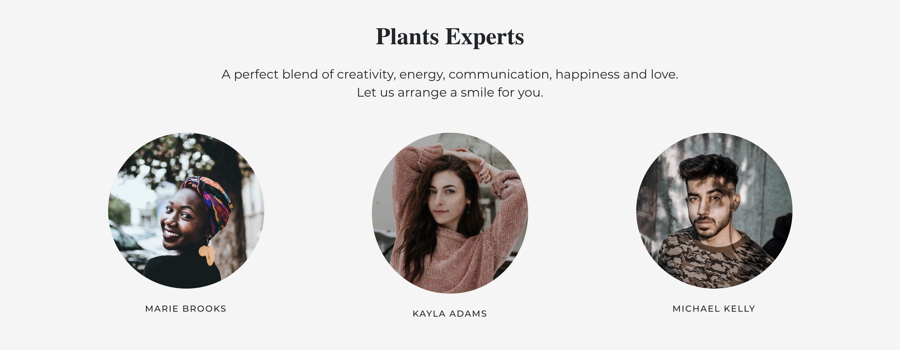

# This project is still a WORK IN PROGRESS

# Welcome to Urban Roots

## ~ Your new online plant delivery website! ~

 

### Live production site available [here](https://urban-roots.netlify.app/)!

 

### The Stack

- Programming Language - JavaScript
- Frontend - React & Styled Components
- Framework - Gatsby
- Backend - GraphQL
- Authentication - Firebase
- Data Management - Contentful
- Shopping Cart - Snipcart
- Contact Form - Formspree.io
- Styling - Bootstrap & CSS & Material UI
- Hosting - Netlify

 

### This project was built to mimic an actual online plant website with features that include, customer reviews, plants for purchase, inspiration ideas, about the company and a contact form.

 

### This is the register page, where a user can create an account!

 

### This is the login page, where a user can login to their account!

 

### This is the password reset page, if a user forgets their password all they need to do is provide their email and will receive an email with instructions on how to reset their password.

 

### In the about page, we go into detail about Urban Roots' mission on providing great quality plants & much more!

 

